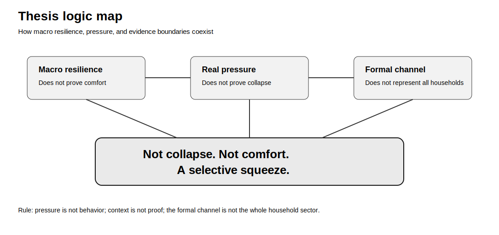

# Red-team thesis

## Visual

The thesis was attacked from two sides:

1. **Comfort:** the economy is resilient, so pressure is overstated.
2. **Collapse:** pressure is real, so the economy is collapsing for households.

Both attacks fail.

The comfort story fails because it generalizes macro and formal-channel evidence beyond valid coverage.

The collapse story fails because it converts pressure channels into a universal conclusion the evidence does not prove.

The surviving thesis is:

**Not collapse. Not comfort. A selective squeeze.**

Data file:

`data/red_team_argument_matrix_v1.csv`
