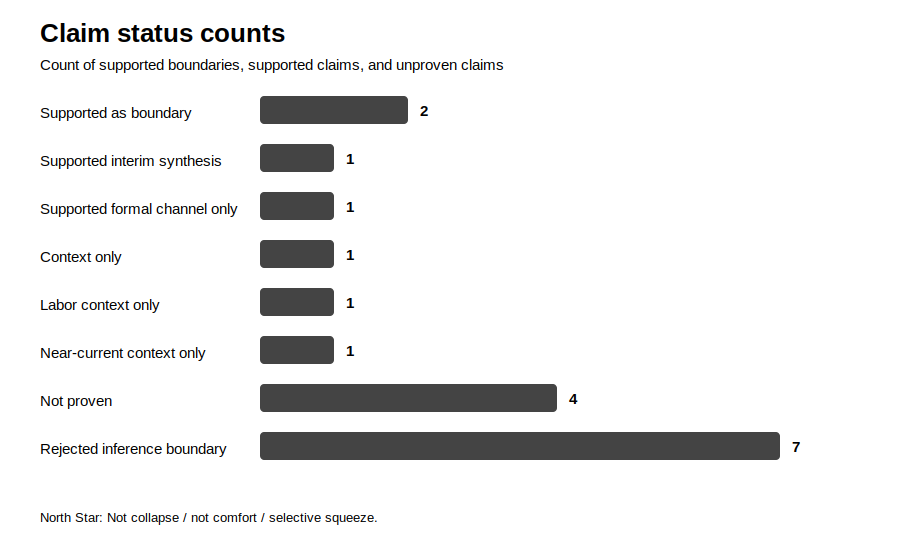
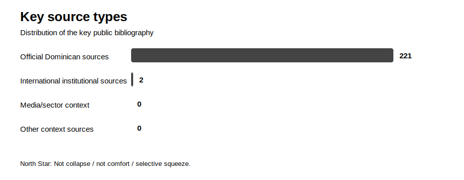

# Visuals

This page summarizes the investigation through simple maps and charts.

## Thesis logic map

## Claim status counts

This chart summarizes how many claims are supported, how many remain unproven, and how many inference boundaries were rejected.

## Key source types

This chart summarizes the distribution of the key public bibliography.

## How to read these visuals

The visuals do not add new evidence. They only summarize the boundaries already documented in the claims audit, red-team, and bibliography.

The conclusion remains:

**Not collapse. Not comfort. A selective squeeze.**
