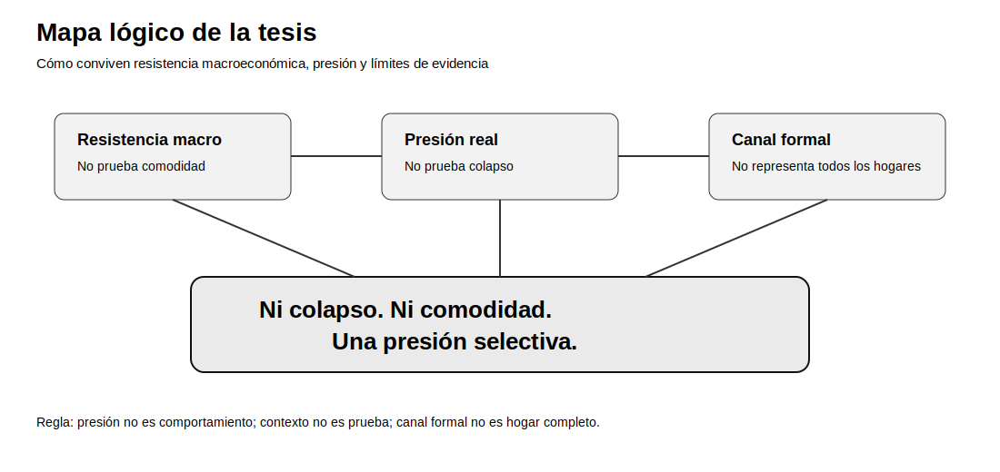
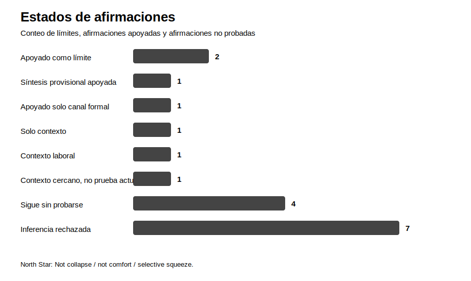
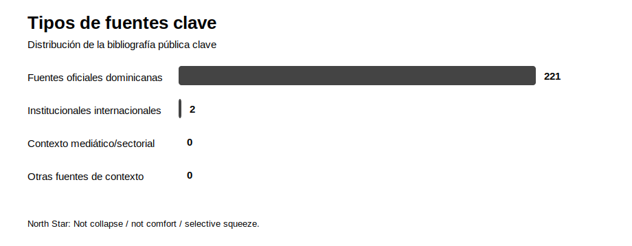

# Visuales

Esta página resume la investigación en mapas y gráficos simples.

## Mapa lógico de la tesis

## Estados de afirmaciones

Este gráfico resume cuántas afirmaciones están apoyadas, cuántas siguen sin probarse y cuántas inferencias fueron rechazadas.

## Tipos de fuentes clave

Este gráfico resume la distribución de la bibliografía pública clave.

## Cómo leer estos visuales

Los visuales no añaden evidencia nueva. Solo resumen los límites ya documentados en la auditoría de afirmaciones, el red-team y la bibliografía.

La conclusión sigue siendo:

**Ni colapso. Ni comodidad. Una presión selectiva.**
